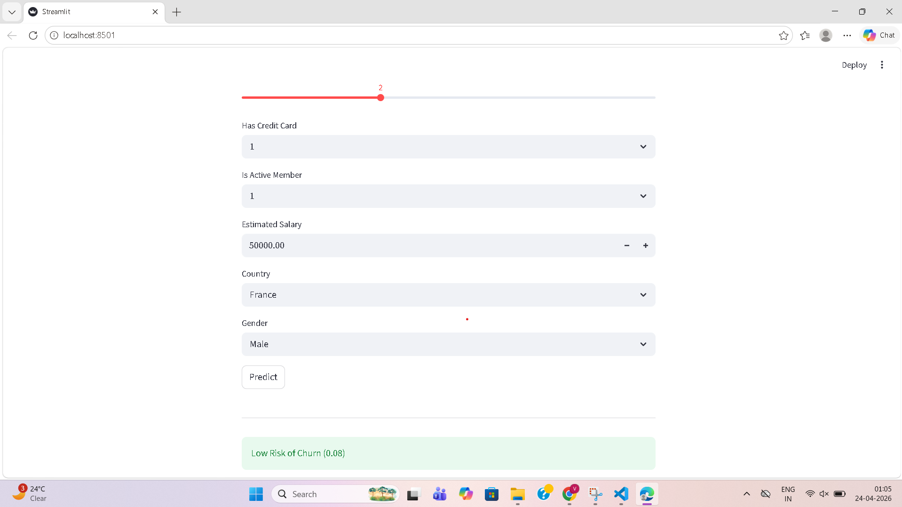

# 🏦 Bank Customer Churn Prediction

## 🌐 Live App
https://veeruchalla88-bank-customer-churn-prediction-app-brinqp.streamlit.app

## 📊 Overview
This project predicts whether a bank customer will churn using Machine Learning.

## 🚀 Features
- Data preprocessing and EDA
- Random Forest model
- Feature importance analysis
- Streamlit web app for real-time prediction

## 🧠 Model Performance
- Accuracy: ~86%
- Includes churn probability prediction

## 💻 Tech Stack
- Python
- Pandas, NumPy
- Scikit-learn
- Streamlit

## ▶️ Run Locally
```bash
pip install -r requirements.txt
streamlit run app.py
## 📸 App Preview


